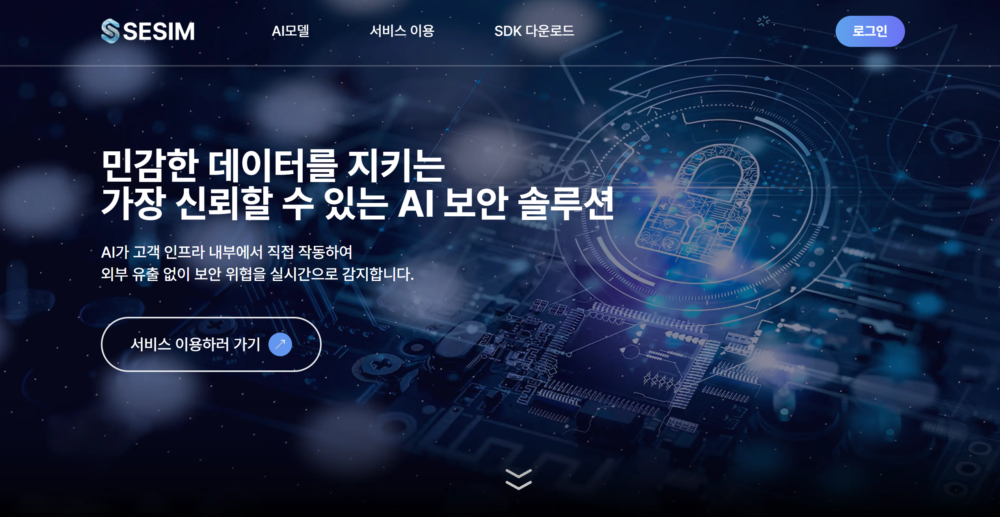

# 🛡️SESIM
#### 고객 인프라에 배포하여 실행하는 SaaS형 보안 플랫폼 

#### [세심 이용하기](http://www.sesim.site/)   

## 💡기획배경
  
GPT 같은 AI를 도입하고 싶지만,  
**데이터 유출** 우려로 망설이는 보안 업계를 위해 탄생했습니다.

**SESIM**은  
>고객 인프라 내부에 직접 배포되어,  **외부 전송 없이** AI가 보안 데이터를 분석하는  **SaaS형 보안 솔루션**입니다.

- 데이터는 외부로 나가지 않음  
- AI 분석은 전부 내부에서 수행  
- 민감한 보안 데이터도 **안심하고 활용**
  

## 🛠️주요기능 소개   

#### ✔️고객 전용 인프라 자동배포
- 클릭 몇 번으로 전용인프라 자동배포
- 배포과정 실시간 확인가능
- 도움말 페이지 제공
 

#### ✔️자체 제작 보안 AI모델 및 대시보드 제공
- 공격 판별, 공격 유형 분류 가능 자체제작 보안AI 모델 제공
- 실시간 결과 그라파나 대시보드 제공
 

#### ✔️요금 시각화 대시보드 제공
- 기간별 요금조회, 프로젝트별 요금 조회기능으로 간편한 요금 확인가능

 

## 시연

#### <메인 페이지>

#### <AI 모델 페이지>

#### <서비스 이용 페이지>

#### <SDK 다운로드 페이지>

 

## 👨‍🔧기술 소개

#### ✔️아키텍처 구조
- SESIM SaaS 인프라 ↔ 고객 인프라 분리 구조
- 고객 인프라에 배포된 AI가 로컬 데이터 분석

#### ✔️자동배포
- Terraform + Kubernetes 기반 자동화 배포 파이프라인
- K3S 경량 클러스터 도입 → 빠른 설치 및 저사양 환경 대응

#### ✔️보안 AI 모델
- 머신러닝 기반 자체 제작 AI 모델
- FastAPI 서비스 제공 → API 호출로 보안 분석 결과 제공
- ZAP 도구 활용 실제 웹 공격 시뮬레이션 결과
    - 총 92건 중 87건 탐지 (탐지율 91.6%)
    - 공격 유형 분류 정확도 평균 85% 이상

#### ✔️시각화 대시보드
- Grafana 기반 실시간 모니터링 제공
- 모델 탐지 결과 및 보안 현황 시각화
 

## 📐 아키텍쳐

 

## 👨‍👩‍👧‍👦 팀원소개 및 역할 
| 이름 | 이미지 | 역할 |
| --- | ------------- | --------------------------------------------------------------------------------------- |
| **손은주**|  | **팀장,AI**     • AI모델링, 학습데이터 수집, 모델 설계 및 학습 등등등등등  • 프로젝트 총괄|
| **박진훈** |  | **Client BE** |
| **배지해** |  | **DevOps** |
| **심근원** |  | **SaaS FE** |
| **안주현** | | **Client FE**   |
| **하시윤** |  | **SaaS BE** |

## ✏️기술스택

### 프론트

### 백엔드

### 인프라

### AI

